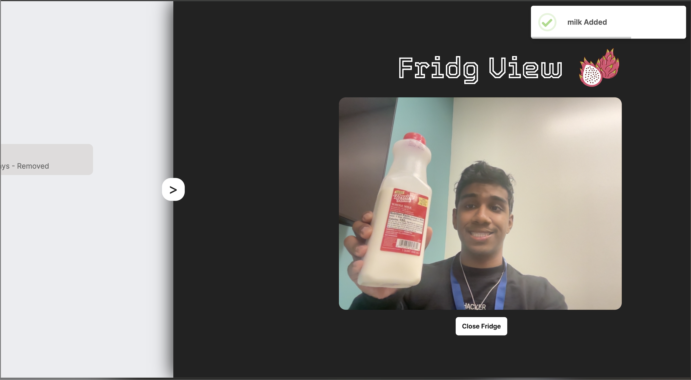
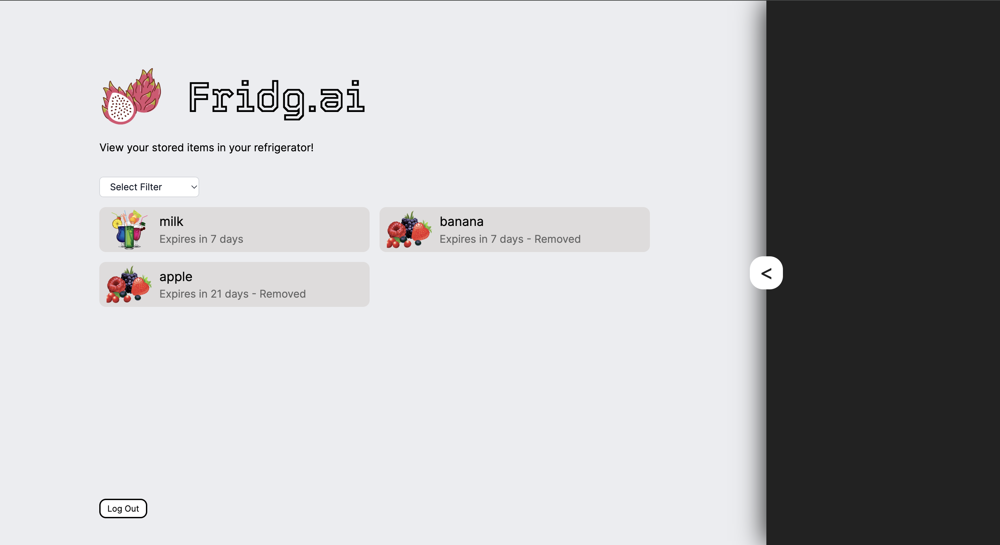

# Fridg.ai – CatapultHacks 2024

# Demo: [link](https://www.youtube.com/watch?v=b7VOOHsYkdk)

**Background**:
In the United States, approximately 40% of the food harvested goes to waste each year. On average, an American individual discards over $2,700 worth of food annually. Surprisingly, 20% of Americans would be willing to accept a $10,000 pay cut to combat this issue. One of the top five reasons for food waste is the lack of organization in refrigerators.

**Our Solution**:
Introducing our Smart Fridge Companion, a sleek device that tracks food items entering and leaving your fridge, automatically notifying you when items are about to expire via an user-friendly app. With advanced sensors and machine learning algorithms, it streamlines inventory management, reduces food waste, and enhances your kitchen experience.

**Infrastructure:**

**Our Application:**

